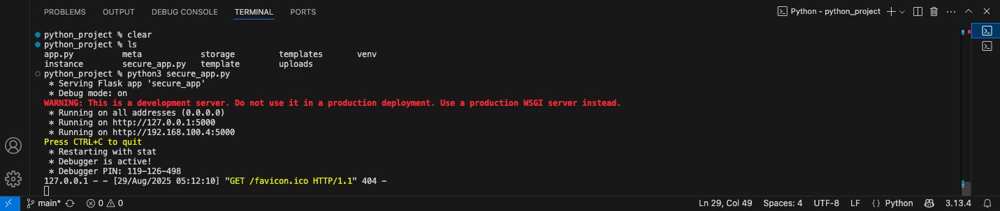
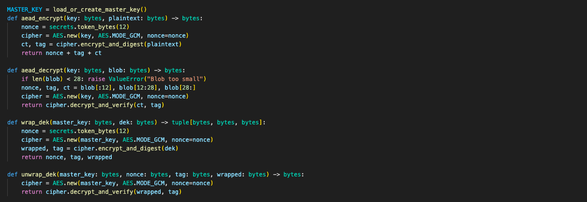
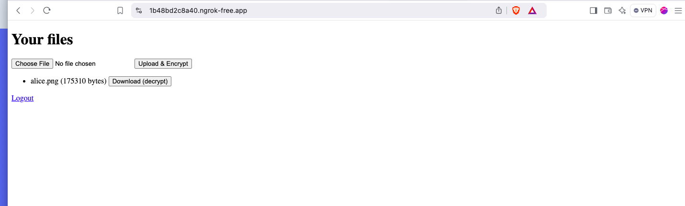
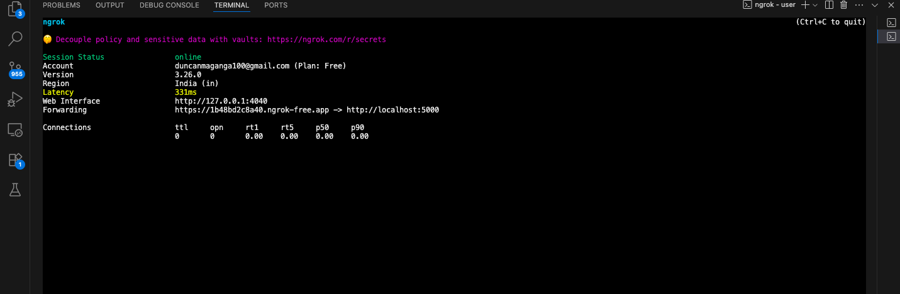
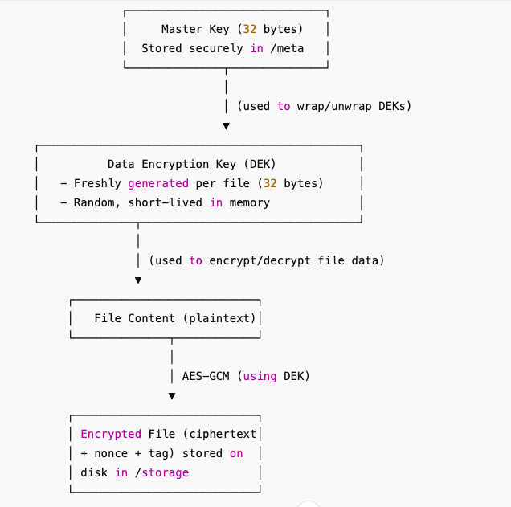

# Secure File Sharing System  


**Project:** Secure File Sharing System  
**Tools Used:** Python Flask, Postman, Ngrok,curl  
**Prepared by:** Duncan Maganga  
**Date:** August 23, 2025    


## Executive Summary
This project forcused in desinging and implementing of secure file sharing system, I build a simple and effective platform that allows users to safely upload and download files as security being the primary consideration.
The system is mainly build using Python Flask for the backend and HTML for the frontend. To make sure that confidentiality is maintained to top notch I used AES encryption to all files at rest and during transer. I tested the system with **Postman** and **curl** and validated the system  performance.

## Purpose and Scope  

In today's digital lanscape alot of attacks have recorded and ensuring that we have a realiable mechanisms to exchange data without exposing them to unauthorized peoples, reducing the rate of cyber threats across industries such as healthcare, legal and finance we need a system with ensures confidentiality. The main purpose for this project was to desing and implement a sucure file sharing system that ensures top notch confidentiality, itergrity, and safe transer of data between users. 

## Tools and Technologies Used  

This prpoject leverages a combination of backend frameworks, cryptography libraries, and frontend technologies to create a secure and functional file-sharing app.  

**Tools**  
     * **Python Flask:** Backend framework for handling file uploads and download routes and encryption logic.  
     * **PyCryptodome:** Python cryptography library used for implementing AES-256-GCM encryption and decryption.  
     * **HTML:** Frontend UI for file upload and download  
     * **dotenv:** Secure storage environment for storing encryption keys.  
     * **Postman:** API testing tool for verifying uploads and downloads endpoints  
     * **curl:** CLI for testing API request and encryption output  
     * **Git & Github:** Version contol and collaboaration platform for managing project code.  
     * **Checksum Tools(SHA256):** For verifying intergrity before and after encryption and decryption.  
     * **Ngrok:** A tool used to create secure tunnel from your local machine to the internet.  
     

## 1. Setting up Flask in Vs code

On your terminal create a folder where you will be running your project, set up a virtual environemnt and install all the Flask packages. 
create a basic app that will encrypt files before uploading and decrypting when downloading. 



### AES-GCM Encryption with Key Wrapping for Secure File Management
This code utilizes AES-GCM, which combines authentication in one step, which is mostly used in TLS/HTTPS and secure file storage. It also ensures that when someone tampers with the data, the tag verification fails during decryption, giving assurance of confidentiality and integrity. The same key used for encryption is the same key used to decrypt the data. This is achieved by wrapping the key with the master key stored encrypted together, proving good key management. 



### Core application files   
The following files were developed to implement the system    
- **app.py** - Flask application  
- **models.py** - Database models (SQLAlchemy)  
- **templates** - UI templates for file uploads and downloads  

### Running the application  



## System Architecture
**Secure File Sharing System** was designed with layered architecture mainly basing its forcus on confidentiality, Intergrity and Availability.  
### Workflow
1. **File Upload**    
User uploads the file using Flask web portal build on HTML, the file immediately is encrypted using **AES-256-GCM** before is stored. All metadata eg filename, upload date, filepath etc is stored in the database.  
2. **File Storage**  
Encrypted files are stored in the upload directory, this ensures that the files don't touch the disk ensuring confidentiality at rest.  
3. **File Download**  
The user request file from the server, the system immeadiatly decrypts the file using encryption keys. The file is decrypted and streamed to the client as plain text.  
4. **Key Management**  
Master key(32 bytes) long term key is stored in master.key in env which is used to wrap/unwrap Data Encryption Keys(DEKs). This DEKs are randoml generated per file which encrypts file's content with AES-GCM. Ciphertext are stored on disk and wrapped DEK stored in DB.
5. **Ngrok**  
This serves as a public gateway and lets remote users to test uploading/downloading files to the app while the system enforces encryption with Master Key + DEKs.  

**Installing Ngrok**
Register Ngrok from their website and get the authentication key.  
on your teminal 
```
ngrok config add-authtoken "YOUR TOKEN"
```
Start your tunnel  
```
ngrok http 5000
```
ngrok will give you a link that can be shared.  



 


**Flow:** ==> File → encrypted with DEK → DEK wrapped with Master Key → both stored.   

  

